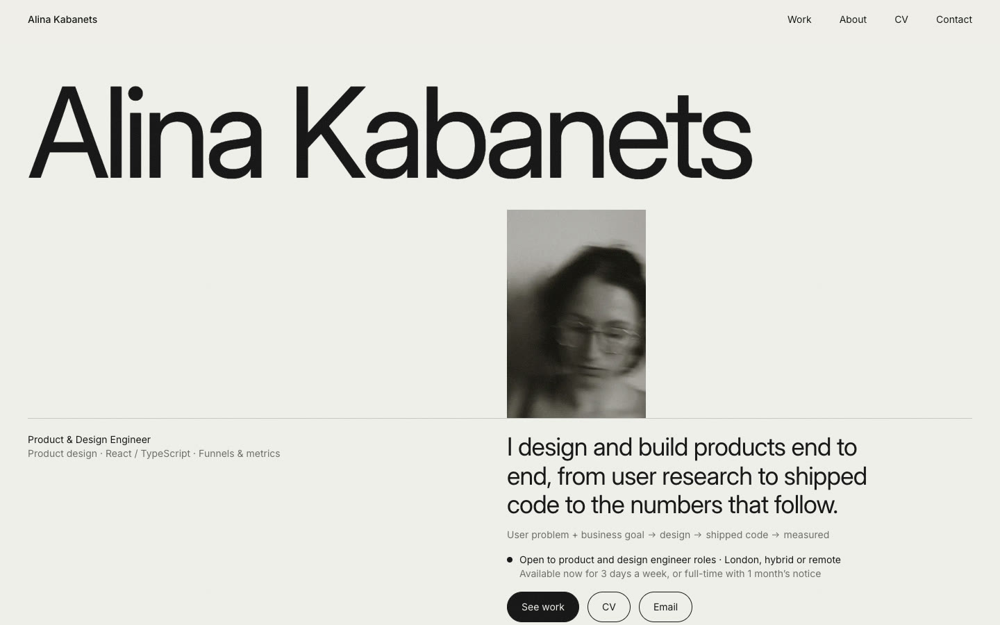
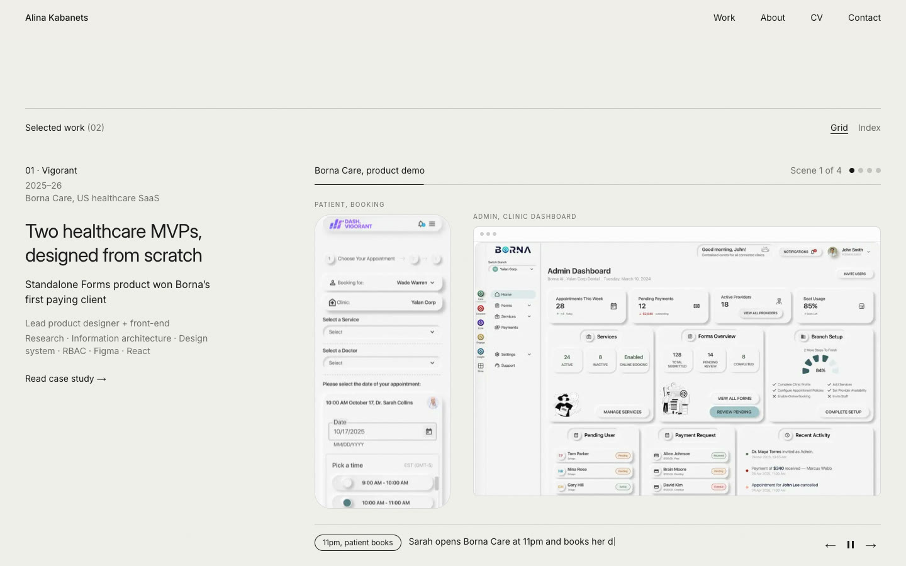

# alinakabanets.com

My portfolio as a product and design engineer: two case studies, a live product demo and a before/after of a landing page I rebuilt.

**Live site: [alinakabanets.com](https://alinakabanets.com)**



## What's on it

- **[Two healthcare MVPs, designed from scratch](https://alinakabanets.com/work/vigorant-healthcare-mvps)**: a patient portal and an admin portal for Borna Care, from research and user flows to a design system and shipped UI.
- **[From measuring the funnel to rebuilding the page](https://alinakabanets.com/work/deaku-landing-page)**: finding where visitors left Deaku's landing page, then redesigning, rebuilding and instrumenting it.



## Things I built for it

| | |
|---|---|
| **Product demo player** | Plays a product story scene by scene: a phone screen and an admin screen side by side, a caption that types itself out, and long screens that scroll. Built from still images and code, so it stays sharp and loads fast. |
| **Before / after player** | Switches between the old landing page and a screen recording of the new one. |
| **Case study blocks** | Sections, figures with captions, ratio-only charts, a permissions table and a code block, so every case study follows the same structure. |
| **Content as data** | All text and project details live in `content/`, separate from the components that display them. |

## How it's built

- **Next.js 16** (App Router), **React 19**, **TypeScript** and **Tailwind CSS 4**.
- **Every page is static.** Pages are prebuilt as HTML and served by Vercel.
- **Motion never blocks content.** Demos play only while on screen, can always be paused, and stay still for visitors who have reduced motion turned on.
- **Accessible by default:** semantic HTML, a skip link, visible keyboard focus, alt text on every image, and captions that screen readers get in full.
- **Link previews and SEO:** a generated preview image for every page, canonical URLs, a sitemap and structured data.
- **Security headers,** including a content security policy, set in `next.config.ts`.
- **Privacy:** no cookies and no tracking scripts. Cookieless analytics (Umami) is wired in but switched off until it's configured.

## Project structure

```
app/          Pages, metadata, sitemap, generated preview images
components/   Hero, work list, demo players, case study blocks
content/      Profile, projects and case study write-ups
lib/          Small shared helpers
public/       Images, videos and the CV
```

## Run it locally

```bash
npm install
npm run dev      # http://localhost:3000
npm run lint
npm run build    # production build
```

Pushing to `main` deploys to Vercel.

## How I worked

I designed this site directly in code and built it with [Claude Code](https://claude.com/claude-code) as a pair. I set the direction, structure, copy and visual decisions, and reviewed every change in the browser before it shipped.

## Using this code

You're welcome to read the code and learn from it. The text, photographs, case study images and recordings are my own work or shown with permission, so please don't reuse them.

## Contact

[aokabanets@gmail.com](mailto:aokabanets@gmail.com) · [LinkedIn](https://www.linkedin.com/in/alina-kabanets/) · London, UK
